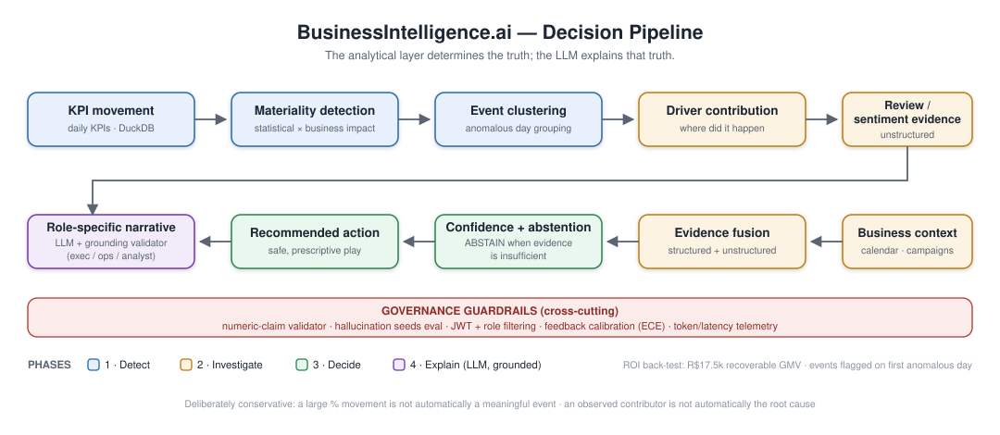

# BusinessIntelligence.ai

> **Decision intelligence for marketplace operations teams.**
> **From KPI movement to evidence-backed action.**

BusinessIntelligence.ai is an end-to-end **decision-intelligence system** that detects meaningful business KPI movements, investigates *where* the change occurred, combines structured and unstructured evidence, estimates confidence, **abstains when evidence is insufficient**, recommends safe business actions, and generates evidence-grounded narratives for different user roles.

**Who it is for:** marketplace and e-commerce operations teams. The
Executive view is tailored to the **Head of Marketplace Operations**, the
Operations view to the **Marketplace Ops Team Lead**, and the Analyst view
to the **Business/Data Analyst**.

**Proven business impact:** a deterministic, assumption-transparent
back-test on the shipped data estimates **R$17.5k of recoverable GMV**
across 15 flagged negative events (R$228k at risk), with events detected
on their **first anomalous day** — see the
[Business Impact (ROI)](#12-llm-layer--narrative-governance) panel and
`GET /api/roi/summary`.

**Preparing a demo?** Follow [`docs/DEMO_SCRIPT.md`](docs/DEMO_SCRIPT.md) —
a rehearsed 3-minute narrative arc from 2am detection to validated
narrative to ROI close.

The project is designed around one core principle:

> **The analytical layer determines the truth; the LLM explains that truth.**

<p align="center">
  
  
  
  
  
  
  
</p>

---

## 📑 Table of Contents

1. [What the Project Does](#1-what-the-project-does)

---

## 🎬 60-Second Demo

<p align="center">
  
</p>

> Executive view, event 66: a 2am GMV drop is flagged on its **first anomalous day**, investigated down to
> driver level, fused with review evidence, narrated in plain language (only after the grounding validator
> passes), and closed with the **back-tested ROI** panel.

<details>
<summary><strong>How to regenerate <code>docs/img/demo.gif</code></strong> (maintainer note)</summary>

1. Start the stack: `uvicorn api.main:app --port 8000` and `streamlit run dashboard/app.py`.
2. Follow [`docs/DEMO_SCRIPT.md`](docs/DEMO_SCRIPT.md) — Executive role, event 66 (fallback: event 37).
3. Record the 0:00–3:00 arc (or just 0:25–2:35) with OBS / ScreenToGif / PowerShell + ffmpeg.
4. Export as **GIF ≤ 10 MB** (720p, 12–15 fps) → save as `docs/img/demo.gif` → this section renders it.

</details>

---

## 1. What the Project Does

A traditional dashboard can tell a business user:

> "Marketplace GMV increased."

BusinessIntelligence.ai goes further:

<p align="center">
  
</p>

<details>
<summary><strong>View the pipeline as text</strong></summary>

```text
KPI movement
    ↓
Materiality detection
    ↓
Event clustering
    ↓
Driver contribution
    ↓
Review / sentiment evidence
    ↓
Business context
    ↓
Evidence fusion
    ↓
Confidence + abstention
    ↓
Recommended action
    ↓
Role-specific narrative
```

</details>


The system is deliberately conservative:

- A **large percentage movement is not automatically** a meaningful business event.
- An **observed contributor is not automatically** a root cause.
- **Insufficient evidence always produces an explicit `ABSTAIN`**, never a confident guess.

---

## 2. Key Capabilities

### 📈 KPI Intelligence
- KPI semantic contract: metric definition, grain, date field, currency, governance metadata.
- Daily KPI construction from ecommerce/order data.
- Seasonal baselines and robust anomaly scoring.
- Materiality scoring combining statistical unusualness **and** business impact.
- Event clustering for multi-day movements.

### 🔍 Driver Investigation
- GMV decomposition into **order-volume** and **AOV** effects.
- Segment contribution analysis across customer state, category, and seller dimensions.
- Evidence ranking based on observed contribution.

### 💬 Unstructured Evidence
- Review aspect tagging.
- Aspect-level sentiment using a multilingual Hugging Face model.
- Review evidence comparison between event and comparison periods.

### 🧾 Evidence & Governance
- Multi-source evidence fusion with explicit confidence scores.
- `ABSTAIN`, `WEAK`, and `CONTRADICTED` states.
- Safe action rules that block high-impact interventions on insufficient evidence.
- Analytical lineage and LLM governance metadata.

### 🧪 Causal Analysis
- Observational causal analysis of `late_delivery → review_score`.
- Propensity adjustment and **doubly robust AIPW estimation**.
- Bootstrap uncertainty interval; propensity overlap and balance diagnostics.
- Explicit causal assumptions and limitations, with a production status that can downgrade poor-quality causal evidence.

### 🤖 LLM Narrative Generation
- Executive and Operations narratives from evidence-grounded prompts.
- All quantitative values come from the deterministic analytical layer.
- A narrative validator checks numbers, statuses, uncertainty, currency, causal wording, and driver claims.
- LLM telemetry: latency, token usage, model calls, estimated cost.

### 🎯 Scenario Testing
- Controlled promotion and inventory-constraint scenarios.
- Contradictory/ambiguous and sparse-history cases.
- Scenario scorecard for driver identification and action safety.

### 👥 Role-Based Access
| Role | Purpose |
|---|---|
| **Executive** | High-level KPI movement, contribution, confidence, decisions |
| **Operations** | Operational drivers, actions, owners, monitoring |
| **Analyst** | Full evidence, lineage, causal evidence, governance, feedback |

The prototype uses application-level filtering rather than enterprise SSO/JWT/RBAC infrastructure.

### 🔁 Human-in-the-Loop Feedback
Analysts classify an assessment as `CORRECT`, `INCORRECT`, or `MISSING_CONTEXT`. Feedback is stored as measurable calibration evidence — the system intentionally does **not** overwrite production confidence from a tiny sample.

---

## 3. System Architecture

```text
                         ┌─────────────────────┐
                         │   Raw Data Sources  │
                         │ Olist + context     │
                         └──────────┬──────────┘
                                    │
                                    ▼
                         ┌─────────────────────┐
                         │   Ingestion Layer   │
                         │      DuckDB         │
                         └──────────┬──────────┘
                                    │
                                    ▼
                 ┌──────────────────────────────────┐
                 │     KPI / Analytical Layer       │
                 │ daily KPIs + enriched facts      │
                 └────────────────┬─────────────────┘
                                  │
                  ┌───────────────┼────────────────┐
                  ▼               ▼                ▼
             Materiality      Drivers          Reviews
             + events         + decomposition  + sentiment
                  │               │                │
                  └───────────────┼────────────────┘
                                  ▼
                         ┌─────────────────────┐
                         │  Evidence Fusion    │
                         │ confidence +        │
                         │ abstention          │
                         └──────────┬──────────┘
                                    │
                      ┌─────────────┼─────────────┐
                      ▼             ▼             ▼
                   Actions       Causal       Scenarios
                      │          analysis          │
                      └─────────────┼──────────────┘
                                    ▼
                         ┌─────────────────────┐
                         │ Canonical Insight   │
                         └──────────┬──────────┘
                                    ▼
                         ┌─────────────────────┐
                         │  LLM Narratives     │
                         │  + validation       │
                         └──────────┬──────────┘
                                    │
                         ┌──────────┴──────────┐
                         ▼                     ▼
                  ┌─────────────┐       ┌─────────────┐
                  │  FastAPI    │       │  Streamlit  │
                  │  (serving)  │       │ (dashboard) │
                  └─────────────┘       └─────────────┘
```

---

## 4. Tech Stack

| Layer | Technology | Purpose |
|---|---|---|
| Warehouse | **DuckDB** | In-process analytical database for all KPI/segment tables |
| Data processing | **pandas**, **NumPy**, **SciPy** | KPI construction, decomposition, statistics |
| Machine learning | **scikit-learn** | Clustering, propensity models |
| NLP / sentiment | **Hugging Face Transformers**, **PyTorch**, **SentencePiece** | Multilingual aspect-level review sentiment |
| LLM narratives | **Provider router**: Groq, OpenRouter, or local OpenAI-compatible server (Ollama / LM Studio / llama.cpp / vLLM) | Evidence-grounded story generation |
| Default LLM config | **Local `qwen3:1.7b` via Ollama** (no key required), cloud fallbacks available | Fully local, private inference |
| API | **FastAPI**, **Uvicorn**, **Pydantic** | Insight/action/feedback serving layer |
| Dashboard | **Streamlit**, **Plotly** | Role-based decision workspace |
| Configuration | **python-dotenv** | `.env`-based secret & LLM configuration |

---

## 5. Project Structure

```text
businessintelligence-ai/
├── run_pipeline.py            # Orchestrates the full analytical pipeline
├── requirements.txt           # Pinned Python dependencies
├── .env.example               # Safe env-var template (commit this)
├── .env                       # Your real secrets (NEVER commit — git-ignored)
│
├── ingestion/                 # Raw data → DuckDB warehouse, KPI & analytical tables
├── anomaly/                   # Seasonal baselines, robust anomaly scoring, changepoints
├── materiality/               # Materiality engine + multi-day event clustering
├── drivers/                   # GMV decomposition, segment tables, contribution, investigation
├── nlp/                       # Review aspect tagging + aspect-level sentiment
├── evidence/                  # Evidence graph, review evidence, confidence, insight build
├── actions/                   # Safe action recommendation engine
├── causal/                    # AIPW causal estimation, diagnostics, causal evidence
├── scenarios/                 # Controlled scenario engine, sparse-history, evaluation
├── feedback/                  # Analyst feedback capture + calibration
├── security/                  # Role-based information filtering
├── personas/                  # Executive / Operations persona builders + tests
├── llm/                       # Story generator + narrative validator (Groq/OpenRouter)
├── telemetry/                 # Runtime & LLM usage telemetry
├── config/                    # KPI contracts + llm_config.yaml
├── api/                       # FastAPI application (api/main.py)
├── dashboard/                 # Streamlit application (dashboard/app.py)
├── docs/                      # GETTING_STARTED.md, ARCHITECTURE.md
└── data/
    ├── raw/                   # Input CSVs (Olist + simulated business context)
    │   ├── olist/             # Orders, items, payments, reviews, customers, sellers…
    │   ├── funnel/            # Closed deals + marketing qualified leads
    │   └── simulated/         # business_context.csv
    ├── warehouse/             # businessintelligence.duckdb (generated)
    ├── insights/              # latest_insight.json + persona stories & validations
    ├── causal/                # Causal effect, diagnostics, evidence, production status
    ├── scenarios/             # Scenario evaluation outputs
    └── feedback/              # Feedback records + calibration report
```

---

## 6. Getting Started — Step by Step

Follow these steps in order. Every command assumes **Windows PowerShell** from the repository root (adjust for macOS/Linux where noted).

### Step 0 — Prerequisites

| Requirement | Version | Notes |
|---|---|---|
| Python | **3.12+** | 3.13 also supported; pinned deps (`numpy`, `scipy`) require ≥3.12 |
| pip | latest | ships with Python |
| Git | any recent | to clone the repository |
| LLM API key | Groq and/or OpenRouter | required only for narrative generation |
| Disk | ~4 GB | PyTorch + Transformers models are large |
| OS | Windows / macOS / Linux | primary development target is Windows |

### Step 1 — Clone the repository

```powershell
git clone https://github.com/mokshith27/businessintelligence-ai.git
cd businessintelligence-ai
```

### Step 2 — Create and activate a virtual environment

```powershell
# Windows PowerShell
python -m venv .venv
.\.venv\Scripts\Activate.ps1
```

```bash
# macOS / Linux
python3 -m venv .venv
source .venv/bin/activate
```

### Step 3 — Install dependencies

```powershell
python -m pip install --upgrade pip
python -m pip install -r requirements.txt
```

> The sentiment engine needs `sentencepiece` and `protobuf` (already pinned in `requirements.txt`). If the tokenizer still fails, run: `python -m pip install sentencepiece protobuf` and restart the environment.

### Step 4 — Configure environment variables (`.env`)

All secrets and LLM settings live in a `.env` file at the project root.
The loader (`llm/story_generator.py`) reads it automatically via `python-dotenv` (`load_dotenv()`).

**Option A — from the template (recommended):**

```powershell
Copy-Item .env.example .env
# then open .env and fill in your real API keys
```

**Option B — create it manually:** create a file named `.env` in the project root:

```dotenv
# ---- Primary LLM ----
LLM_PROVIDER=groq
LLM_MODEL=openai/gpt-oss-120b

# ---- Fallback models (provider:model,comma-separated) ----
LLM_FALLBACKS=openrouter:openrouter/free

# ---- API keys ----
GROQ_API_KEY=your_groq_api_key_here
OPENROUTER_API_KEY=your_openrouter_api_key_here

# ---- Generation settings ----
LLM_MAX_OUTPUT_TOKENS=800
LLM_TEMPERATURE=0.1
LLM_REASONING_EFFORT=low
LLM_DEBUG=true
```

> 🔐 **Security:** `.env` is listed in `.gitignore` and must **never** be committed. A committed `.env.example` with placeholder values is the safe template. If a real key ever leaks (commit, screenshot, chat), **rotate it immediately** in the provider console.

The full variable-by-variable reference is in [Section 7](#7-environment-variables-reference-env).

### Step 5 — Data setup

The pipeline reads raw CSVs from `data/raw/`:

```text
data/raw/olist/       → orders, order_items, order_payments, order_reviews,
                        customers, sellers, products, geolocation, category translation
data/raw/funnel/      → closed deals, marketing qualified leads
data/raw/simulated/   → business_context.csv
```

A fresh clone includes these files. If you removed them, restore the Olist e-commerce dataset (public Kaggle dataset) into `data/raw/olist/` before running the pipeline.

### Step 6 — Run the analytical pipeline

This is the **one command** that builds every analytical artifact end-to-end:

```powershell
python run_pipeline.py
```

The runner validates all 21 scripts up front, executes them in dependency order with UTF-8 safe settings on Windows, prints per-step timings, and fails fast (non-zero exit) if any step fails. See [Section 8](#8-the-analytical-pipeline) for the exact stage list.

Expected completion markers:

```text
[OK] All pipeline files exist.
...
FULL PIPELINE COMPLETE
Total execution time: ... seconds
Steps completed: 21/21
  data/insights/latest_insight.json
  [OK] data/insights/executive_story.json
  [OK] data/insights/operations_story.json
```

### Step 7 — Start the API (terminal 1)

```powershell
uvicorn api.main:app --reload
```

- Swagger UI: `http://127.0.0.1:8000/docs`
- ReDoc: `http://127.0.0.1:8000/redoc`

### Step 8 — Start the dashboard (terminal 2)

```powershell
streamlit run dashboard/app.py
```

Dashboard: `http://localhost:8501`

### Step 9 — Verify the installation

| Check | How |
|---|---|
| Warehouse built | `data/warehouse/businessintelligence.duckdb` exists |
| Canonical insight | `data/insights/latest_insight.json` exists |
| Narratives generated | `data/insights/executive_story.json`, `operations_story.json` exist |
| API healthy | `GET http://127.0.0.1:8000/api/insights/latest` returns JSON |
| Dashboard loads | Role selector + KPI snapshot render at `localhost:8501` |
| LLM configured | `GET http://127.0.0.1:8000/api/security/test` and telemetry show `groq_key_configured: true` |

### Quick-start recap

```powershell
git clone https://github.com/mokshith27/businessintelligence-ai.git
cd businessintelligence-ai
python -m venv .venv; .\.venv\Scripts\Activate.ps1
python -m pip install -r requirements.txt
Copy-Item .env.example .env        # then add your API keys
python run_pipeline.py             # build all artifacts
uvicorn api.main:app --reload      # terminal 1
streamlit run dashboard/app.py     # terminal 2
```

### One-command Docker deployment (for judges / reviewers)

The whole stack ships as a Docker Compose app. The warehouse is seeded
automatically on first run (the deterministic pipeline, excluding the
runtime LLM step), so a reviewer gets a working dashboard + API with a
single command:

```bash
docker compose up --build
```

- Dashboard → http://localhost:8501
- API / Swagger → http://localhost:8000/docs

Optional: enable a fully-local Ollama provider for private AI narratives:

```bash
docker compose --profile llm up --build
```

Environment overrides (e.g. cloud keys) are read from your `.env` file
via the compose `environment:` substitutions. Container data persists in
Docker volumes, so restarts are instant once seeded.

---

## 7. Environment Variables Reference (`.env`)

All variables are optional at the code level (safe defaults exist), but **an LLM API key is required** for narrative generation. Values are loaded once at module import via `load_dotenv()` in `llm/story_generator.py`; real values should live only in the local `.env` file.

### Provider & model selection

| Variable | Default | Description |
|---|---|---|
| `LLM_PROVIDER` | `groq` | Primary narrative provider. Supported: `groq`, `openrouter`, `openai`, `anthropic`. Lowercased and trimmed automatically. |
| `LLM_MODEL` | `openai/gpt-oss-120b` | Model identifier for the primary provider. |
| `LLM_FALLBACKS` | `openrouter:openrouter/free` | Comma-separated `provider:model` candidates tried in order if the primary model fails. Example: `openrouter:openrouter/free,openai:gpt-4o-mini`. |

### API keys

| Variable | Required when | Where to get it |
|---|---|---|
| `GROQ_API_KEY` | `LLM_PROVIDER=groq` or a `groq:` fallback | https://console.groq.com/keys |
| `OPENROUTER_API_KEY` | `LLM_PROVIDER=openrouter` or an `openrouter:` fallback | https://openrouter.ai/keys |
| `OPENAI_API_KEY` | `LLM_PROVIDER=openai` or an `openai:` fallback | https://platform.openai.com/api-keys |
| `ANTHROPIC_API_KEY` | `LLM_PROVIDER=anthropic` or an `anthropic:` fallback | https://console.anthropic.com |

The telemetry/health check reports only *whether* each key is configured (`groq_key_configured: true`), never the key itself.

### Generation settings

| Variable | Default | Description |
|---|---|---|
| `LLM_MAX_OUTPUT_TOKENS` | `800` | Maximum tokens per generated narrative. |
| `LLM_TEMPERATURE` | `0.1` | Sampling temperature. Low values keep narratives deterministic and reproducible. |
| `LLM_REASONING_EFFORT` | `low` | Reasoning-effort hint for models that support it: `low`, `medium`, `high`. |
| `LLM_DEBUG` | `true` | Verbose LLM debug logging. Accepts `1`, `true`, `yes`, `on`. |

### Runtime (set by the pipeline runner)

| Variable | Set by | Purpose |
|---|---|---|
| `PYTHONUTF8=1` | `run_pipeline.py` | Forces UTF-8 mode to avoid Windows `cp1252` Unicode errors. |
| `PYTHONIOENCODING=utf-8` | `run_pipeline.py` | Same, for stdout/stderr streams. |

### Security rules for `.env`

1. `.gitignore` already excludes `.env` / `.env.*` and whitelists `!.env.example` — keep it that way.
2. Commit only `.env.example` (placeholders, no real values).
3. Never paste real keys into issues, PRs, screenshots, or chat tools.
4. Rotate any key that may have been exposed — rotation is instant in the provider console.
5. For CI, inject keys as repository secrets instead of files.

---

## 8. The Analytical Pipeline

`python run_pipeline.py` executes **21 scripts in strict dependency order** (validated before the first step runs; the runner aborts on the first failure and reports per-step timing):

| # | Stage | Script | What it produces |
|---|---|---|---|
| 1 | Load raw data & build KPIs | `ingestion/load_and_build_kpis.py` | Initial KPI tables from raw CSVs |
| 2 | Validate relationships | `ingestion/validate_relationships.py` | Referential-integrity checks |
| 3 | Build analytical tables | `ingestion/build_analytical_tables.py` | Enriched analytical facts |
| 4 | Build daily KPI mart | `ingestion/build_daily_kpis.py` | Daily KPI series |
| 5 | Load business context | `ingestion/load_business_context.py` | Business-context tables |
| 6 | Build segment KPI tables | `drivers/segment_tables.py` | Segment-level KPIs |
| 7 | GMV decomposition | `drivers/decomposition.py` | Volume vs. AOV effects |
| 8 | Validate decomposition | `drivers/check_decomposition.py` | Decomposition reconciliation |
| 9 | Driver contribution analysis | `drivers/segment_contribution.py` | Ranked segment contributions |
| 10 | GMV materiality analysis | `materiality/materiality_engine.py` | Materiality scores |
| 11 | Event clustering | `materiality/event_clustering.py` | Multi-day events |
| 12 | Event driver investigation | `drivers/event_investigation.py` | Per-event driver evidence |
| 13 | Review aspect tagging | `nlp/aspect_tagging.py` | Tagged review aspects |
| 14 | Review sentiment analysis | `nlp/sentiment.py` | Aspect-level sentiment |
| 15 | Build evidence foundation | `evidence/evidence_graph.py` | Multi-source evidence graph |
| 16 | Build review evidence | `evidence/review_evidence.py` | Event-vs-baseline review evidence |
| 17 | Confidence & abstention | `evidence/confidence.py` | Confidence scores, `ABSTAIN`/`WEAK`/`CONTRADICTED` |
| 18 | Generate recommended actions | `actions/action_engine.py` | Evidence-gated safe actions |
| 19 | Build canonical insight | `evidence/build_insight.py` | `latest_insight.json` + LLM policy |
| 20 | Build & test personas | `personas/test_personas.py` | Executive/Operations persona views |
| 21 | LLM narratives + validation | `llm/story_generator.py`, `llm/narrative_validator.py` | Persona stories, validated claims, telemetry |

> **Development tip:** when debugging a single layer, run its module directly instead of rebuilding the whole pipeline.

---

## 9. Generated Artifacts

The most useful outputs (all generated locally by the pipeline):

```text
data/insights/latest_insight.json                # Canonical insight (single source of truth)
data/insights/executive_story.json               # Executive narrative
data/insights/operations_story.json              # Operations narrative
data/insights/executive_validation.json          # Executive narrative validation
data/insights/operations_validation.json         # Operations narrative validation

data/causal/delivery_review_causal_effect.json   # Late-delivery → review-score estimate
data/causal/causal_diagnostics.json              # Overlap/balance diagnostics
data/causal/causal_evidence_record.json          # Causal evidence record
data/causal/causal_production_status.json        # Production status (may downgrade evidence)

data/scenarios/scenario_evaluation.json          # Controlled scenario scorecard
data/scenarios/scenario_engine_results.json      # Per-scenario engine results
data/scenarios/engine_evaluation.json            # Engine-level evaluation
data/scenarios/sparse_history_scenario.json      # Sparse-history ABSTAIN check

data/feedback/feedback_records.json              # Analyst feedback
data/feedback/calibration_report.json            # Feedback calibration

data/warehouse/businessintelligence.duckdb       # DuckDB analytical warehouse
```

These artifacts make the analytical process **inspectable and reproducible**. They are not expected to exist in a fresh clone until the pipeline runs.

---

## 10. API Reference

Start FastAPI from the project root:

```powershell
uvicorn api.main:app --reload
```

Interactive Swagger UI: `http://127.0.0.1:8000/docs`

| Method | Endpoint | Purpose |
|---|---|---|
| `GET` | `/` | Service root: application info |
| `GET` | `/api/health` | Service health check |
| `GET` | `/api/insights/latest` | Canonical insight |
| `GET` | `/api/insights/latest/executive` | Executive view of latest insight |
| `GET` | `/api/insights/latest/operations` | Operations view of latest insight |
| `GET` | `/api/insights/latest/validation` | Narrative validation report for the latest insight |
| `GET` | `/api/insights/role?role=executive\|operations\|analyst` | Role-filtered insight |
| `GET` | `/api/kpis` | KPI values and movements |
| `GET` | `/api/events` | Detected KPI events |
| `GET` | `/api/insights/event/{event_id}` | Full event investigation (drivers, evidence, confidence) |
| `POST` | `/api/insights/event/{event_id}/narrative` | Generate and validate an evidence-grounded event narrative |
| `GET` | `/api/drivers` | GMV decomposition and segment driver contributions |
| `GET` | `/api/customer-experience-kpis` | Customer-experience KPIs from review data |
| `GET` | `/api/review-evidence` | Review evidence for an event window |
| `GET` | `/api/actions` | Recommended actions |
| `GET` | `/api/telemetry` | LLM telemetry: latency, token usage, model calls, cost |
| `GET` | `/api/roi/summary` | Back-tested business impact: at-risk GMV, detection lead, recoverable value |
| `POST` | `/api/auth/login` | JWT login: returns a signed bearer token with role claims (demo users in README §17) |
| `GET` | `/api/auth/me` | Validate a bearer token and return the authenticated identity |
| `GET` | `/api/kpis/status` | All 5 KPIs (gmv, orders, aov, late_delivery_rate, review_score) evaluated against their contracts |
| `GET` | `/api/forecast/{kpi_id}?horizon=14` | KPI forecast: damped trend + weekday seasonality with an 80% prediction interval |
| `POST` | `/api/simulation` | Prescriptive simulation: "what happens if we act" — applies an uplift to the forecast |
| `POST` | `/api/watch/simulate-incoming` | Drop a synthetic intraday batch, scan it, and raise alerts (live demo moment) |
| `GET` | `/api/watch/alerts` | Recent intraday alerts with wall-clock detection timestamps |
| `POST` | `/api/feedback` | Submit analyst feedback |
| `GET` | `/api/feedback` | List feedback records |
| `GET` | `/api/calibration` | Feedback calibration report |
| `GET` | `/api/security/test` | Role-filtering behavior checks |
| `GET` | `/api/validation/scenarios` | Controlled scenario results |
| `GET` | `/api/validation/sparse-history` | Sparse-history ABSTAIN check |
| `GET` | `/api/validation/causal` | Causal evidence & diagnostics |
| `GET` | `/api/validation/feedback` | Feedback validation data |

---

## 11. Dashboard

```powershell
streamlit run dashboard/app.py
```

Available at `http://localhost:8501`. The dashboard provides:

- Role selection (Executive / Operations / Analyst);
- KPI snapshot and event information;
- GMV decomposition and driver investigation;
- Recommended actions;
- Evidence, governance, analytical lineage, and LLM governance panels;
- Runtime telemetry and event history;
- Analyst feedback capture and feedback calibration;
- Validation center (scenarios, sparse history, causal).

---

## 12. LLM Layer & Narrative Governance

The story generator (`llm/story_generator.py`) implements a **provider router**
that tries candidates in order and accepts the first output that passes the
section cleaner:

```text
primary provider  →  fallback 1  →  fallback 2  →  ...
```

Supported providers:
- **local** — a local OpenAI-compatible inference server (Ollama by default)
- **groq** — Groq SDK (e.g. `openai/gpt-oss-120b`)
- **openrouter** — OpenRouter (e.g. `openrouter/free`)

### Option A — Fully local (default, no API key)

```powershell
ollama pull qwen3:1.7b
```

Configure `.env`:

```text
LLM_PROVIDER=local
LLM_MODEL=qwen3:1.7b
LLM_BASE_URL=http://localhost:11434/v1
LLM_LOCAL_API_MODE=ollama
LLM_LOCAL_NUM_CTX=8192
LLM_FALLBACKS=local:qwen3:4b
```

Notes:
- Qwen3 is a thinking model; the router disables visible reasoning via
  Ollama's native `/api/chat` endpoint so the full token budget goes to the
  governed narrative.
- After a CUDA out-of-memory failure the router automatically forces
  full-CPU inference for subsequent local requests instead of crashing.
- Keep `LLM_LOCAL_NUM_CTX` at **8192 or above**: the narrative prompts are
  ~4,000 tokens (see Troubleshooting).

### Option B — Cloud providers

```powershell
# Groq
$env:LLM_PROVIDER="groq"
$env:LLM_MODEL="openai/gpt-oss-120b"
$env:GROQ_API_KEY="your_key_here"

# OpenRouter
$env:LLM_PROVIDER="openrouter"
$env:OPENROUTER_API_KEY="your_key_here"
```

Or put the values in a local `.env` file (copy `.env.example`).

Example telemetry recorded for every call:

```json
{
  "model": "openai/gpt-oss-120b",
  "prompt_tokens": 1279,
  "completion_tokens": 443,
  "total_tokens": 1722,
  "model_calls": 1,
  "estimated_cost_usd": 0.00045765
}
```

Governance rules enforced by design:

- The LLM receives **only deterministic analytical values** — it never computes business numbers.
- `llm/narrative_validator.py` checks every narrative for correct numbers, statuses, uncertainty language, currency, causal wording, and driver claims.
- The canonical insight embeds an explicit **LLM policy** (`allowed_llm_tasks` / `forbidden_llm_tasks`).
- Configuration is exposed through `get_llm_configuration()`, which reports key presence but **never returns key values**.

To regenerate narratives manually:

```powershell
python llm/story_generator.py
```

---

## 13. NLP / Sentiment Layer

The sentiment engine uses the multilingual Hugging Face model:

```text
cardiffnlp/twitter-xlm-roberta-base-sentiment
```

Pipeline flow:

```text
Reviews → aspect tagging (nlp/aspect_tagging.py)
        → aspect-level sentiment (nlp/sentiment.py)
        → event-vs-comparison-period review evidence (evidence/review_evidence.py)
```

If SentencePiece/protobuf errors appear, install the tokenizer dependencies and restart:

```powershell
python -m pip install sentencepiece protobuf
```

---

## 14. Causal Analysis

The causal module performs observational causal analysis of `late_delivery → review_score`:

- Propensity adjustment with **doubly robust AIPW estimation**.
- Bootstrap uncertainty interval.
- Propensity overlap and basic covariate-balance diagnostics.
- Explicit causal assumptions and limitations.
- A production status that can **downgrade causal evidence** when diagnostics are poor.

Example estimate:

> Under the observational adjustment assumptions, late delivery is estimated to reduce review score by approximately 1.57 points.

### Important limitation

This is **observational causal inference**, not a randomized experiment. The result depends on assumptions including:

- no important unmeasured confounding after adjustment;
- adequate treatment/control overlap;
- correct treatment definition;
- consistent review measurement.

The system therefore exposes causal assumptions, diagnostics, and limitations instead of presenting an observational estimate as unquestionable proof.

---

## 15. Sparse-History Safety

A controlled scenario simulates a newly launched KPI:

```text
KPI                  : New Premium Category GMV
History points       : 5
Required history     : 30
Latest value         : R$8,100.00
Baseline median      : R$2,500.00
Relative change      : +224.00%
Decision             : ABSTAIN
Confidence           : 0.050
```

The important behavior:

```text
Large movement
    +
Insufficient history
    =
ABSTAIN
```

This prevents the engine from confusing early-stage volatility with a trustworthy material event.

---

## 16. Controlled Scenario Evaluation

### SCN_001 — Promotion-driven movement
Promotion context is present, but the observed mechanism conflicts with the expected positive direction.

```text
Top driver : promotion
Status     : ABSTAIN
Action     : ABSTAIN
Safety     : PASS
```

### SCN_002 — Inventory constraint
Context indicates constrained inventory and negative GMV, but the order mechanism is not fully consistent.

```text
Top driver : inventory_constraint
Status     : ABSTAIN
Action     : ABSTAIN
Safety     : PASS
```

### SCN_003 — Promotion-driven movement 2
Promotion context aligns with positive GMV and positive order growth.

```text
Top driver : promotion
Status     : SUPPORTED
Action     : ACTION_WITH_VALIDATION
Safety     : PASS
```

Final scorecard:

```text
Driver identification : 100%
Context alignment     : 100%
Status handling       : 100%
Safe abstention       : 100%
Action safety         : 100%
Action acceptability  : 100%
Average score         : 1.000
```

---

## 17. Role-Based Security

**JWT authentication is now enforced at the API level** (in addition to the application-level role filtering below). `/api/auth/login` issues a signed HS256 token (role claim, 8h expiry); `/api/auth/me` validates it. Set `AUTH_DISABLED=1` in `.env` to bypass auth for local development — it is **enabled by default**.

**Demo users** (passwords are for the demo only; production would use SSO / an identity provider):

| Username | Password | Role | Persona |
|---|---|---|---|
| `maria.exec` | `demo-exec-2026` | executive | Head of Marketplace Operations |
| `joao.ops` | `demo-ops-2026` | operations | Marketplace Ops Team Lead |
| `ana.analyst` | `demo-analyst-2026` | analyst | Business / Data Analyst |

Passwords are stored as PBKDF2-SHA256 hashes (120k iterations), never plaintext. Quick check:

```bash
curl -X POST http://localhost:8000/api/auth/login \
  -H "Content-Type: application/json" \
  -d '{"username": "maria.exec", "password": "demo-exec-2026"}'
```

The prototype implements application-level information filtering (not enterprise SSO/JWT/RBAC).

### Executive
- **Receives:** KPI, movement, event, top drivers, confidence, actions, executive narrative.
- **Restricted:** customer/seller identifiers, direct contact fields, analyst-only lineage and causal detail.

### Operations
- **Receives:** KPI, event, drivers, confidence, operational actions, operations narrative.
- **Restricted:** customer contact fields.

### Analyst
- **Receives:** full driver evidence, confidence, actions, data quality, lineage, causal evidence, LLM governance, and both narratives.
- **Restricted:** PII such as email, phone, and address in all cases.

Filtering is implemented in `security/role_filter.py` and exposed through `/api/insights/role`.

---

## 18. Human-in-the-Loop Feedback

Analysts evaluate an insight directly from the dashboard:

```text
CORRECT | INCORRECT | MISSING_CONTEXT
```

Feedback is stored in `feedback_records` and a calibration report is generated:

```text
Feedback records : 3
Correct          : 2
Incorrect        : 0
Missing context  : 1
Status           : COLLECTING_FEEDBACK
```

Intended production behavior:

```text
Small sample      → measure calibration only
Sufficient sample → calibration becomes actionable
```

The system intentionally avoids automatic confidence overrides from very small samples.

---

## 19. Validation Philosophy

BusinessIntelligence.ai uses a **deterministic-first** architecture.

### Deterministic / statistical layer
Responsible for: KPI values, baselines, z-scores, materiality, decompositions, contribution, evidence status, confidence, causal estimates, action eligibility, and governance.

### LLM layer
Responsible for: explanation, summarization, persona adaptation, and natural-language formatting.

This prevents the LLM from silently becoming the source of quantitative truth.

---

## 20. Design Principles

1. **Evidence before explanation** — the narrative comes after the analytical evidence.
2. **Contribution is not causality** — a segment can contribute to a movement without being its root cause.
3. **Abstention is a feature** — the engine can explicitly say `Insufficient evidence.`
4. **Business impact matters** — a statistically unusual movement is not automatically a business priority.
5. **Unstructured data is evidence** — reviews supplement, not replace, structured KPI analysis.
6. **Actions require evidence** — no high-impact interventions for contradicted or weakly supported hypotheses.
7. **Human feedback is retained** — analyst feedback becomes measurable calibration evidence.

---

## 21. Troubleshooting

### Narrative endpoint returns 500 with `contains no required sections`

The local model context window (`LLM_LOCAL_NUM_CTX`) is too small. The
narrative prompts are ~4,000 tokens; a window of 2048 makes Ollama truncate
the prompt, cutting off the output-format instructions. The model then omits
the required section headings and the section cleaner rejects every candidate.

Fix:

```text
LLM_LOCAL_NUM_CTX=8192
```

and restart the API. You can verify prompt size versus context window by
checking `prompt_eval_count` in an Ollama `/api/chat` response.

### AI narrative rejected by the evidence-grounding validator

Rejections are intentional governance behavior: the validator refuses
narratives that state numbers, statuses, or causal claims not present in the
deterministic evidence. Small local models occasionally hallucinate a figure;
the API retries with validator feedback before giving up. Re-run the
generation, or switch to a larger `LLM_MODEL` if rejections are frequent.

### `GROQ_API_KEY is not set`
Only required when `LLM_PROVIDER=groq`. For the default fully local setup no
API key is needed. For cloud providers set the matching key:
Set it via your `.env` file (preferred) or for the current PowerShell session:

```powershell
$env:GROQ_API_KEY="your_key_here"
```

Then rerun the story generator. See [Section 7](#7-environment-variables-reference-env) for the full variable reference.

### Hugging Face SentencePiece/protobuf error

```powershell
python -m pip install sentencepiece protobuf
```

Restart the environment and rerun the sentiment module.

### FastAPI returns 500 with NaN JSON values
Analytical endpoints should convert non-finite numeric values to JSON-safe values before returning them.

### Streamlit crashes with `'list' object has no attribute 'get'`
Check the actual JSON structure returned by the validation endpoint. The dashboard normalizes list/dictionary scenario formats.

### Windows console Unicode error
Prefer ASCII-safe logging for console output, or configure stdout/stderr for UTF-8 (`run_pipeline.py` already sets `PYTHONUTF8=1` and `PYTHONIOENCODING=utf-8` for pipeline steps).

### Sparse-history scenario says `ABSTAIN`
Expected behavior when there are insufficient historical observations for a reliable baseline.

### `ModuleNotFoundError: No module named 'dotenv'`
Install the missing dependency: `python -m pip install python-dotenv` (included in `requirements.txt`).

---

## 22. Known Limitations

This project is a decision-intelligence **prototype**, not a production enterprise analytics platform.

1. The causal module uses observational data and cannot eliminate unmeasured confounding.
2. Role-based filtering is application-level authorization, not enterprise authentication.
3. Feedback calibration requires sufficient real analyst feedback before it can meaningfully change confidence policy.
4. Business context is simulated for controlled evaluation scenarios.
5. The causal result is specific to the analyzed treatment/outcome relationship and should not be generalized to unrelated KPI movements.
6. Some downstream analytical artifacts are generated locally and are not expected to exist in a fresh clone until the pipeline is run.

---

## 23. Documentation & Navigation

- 🎤 **3-minute demo script** → [`docs/DEMO_SCRIPT.md`](docs/DEMO_SCRIPT.md) — rehearsed demo arc with Q&A ammunition
- 📖 **Getting Started** → [`docs/GETTING_STARTED.md`](docs/GETTING_STARTED.md) — first-run guide
- 🏗️ **Architecture walkthrough** → [`docs/ARCHITECTURE.md`](docs/ARCHITECTURE.md) — module map
- 🤝 **Contributing** → [`CONTRIBUTING.md`](CONTRIBUTING.md)
- 👥 **Authors & credit** → [`AUTHORS.md`](AUTHORS.md)
- 🗒️ **Changelog** → [`CHANGELOG.md`](CHANGELOG.md)
- 🛡️ **Code of Conduct** → [`.github/CODE_OF_CONDUCT.md`](.github/CODE_OF_CONDUCT.md)

**Maintainers:** [Mokshith](https://github.com/mokshith27) (project lead), [Mukesh](https://github.com/Mukesh1701) (co-maintainer), [Rahul](https://github.com/rahulpatelbollam06) (co-maintainer) (see [`AUTHORS.md`](AUTHORS.md)). Role responsibilities are recorded in [`AUTHORS.md`](AUTHORS.md).

---


only if that is the license you choose for the repository.

2. [Key Capabilities](#2-key-capabilities)
3. [System Architecture](#3-system-architecture)
4. [Tech Stack](#4-tech-stack)
5. [Project Structure](#5-project-structure)
6. [Getting Started — Step by Step](#6-getting-started--step-by-step)
7. [Environment Variables Reference (`.env`)](#7-environment-variables-reference-env)
8. [The Analytical Pipeline](#8-the-analytical-pipeline)
9. [Generated Artifacts](#9-generated-artifacts)
10. [API Reference](#10-api-reference)
11. [Dashboard](#11-dashboard)
12. [LLM Layer & Narrative Governance](#12-llm-layer--narrative-governance)
13. [NLP / Sentiment Layer](#13-nlp--sentiment-layer)
14. [Causal Analysis](#14-causal-analysis)
15. [Sparse-History Safety](#15-sparse-history-safety)
16. [Controlled Scenario Evaluation](#16-controlled-scenario-evaluation)
17. [Role-Based Security](#17-role-based-security)
18. [Human-in-the-Loop Feedback](#18-human-in-the-loop-feedback)
19. [Validation Philosophy](#19-validation-philosophy)
20. [Design Principles](#20-design-principles)
21. [Troubleshooting](#21-troubleshooting)
22. [Known Limitations](#22-known-limitations)
23. [Documentation & Navigation](#23-documentation--navigation)

